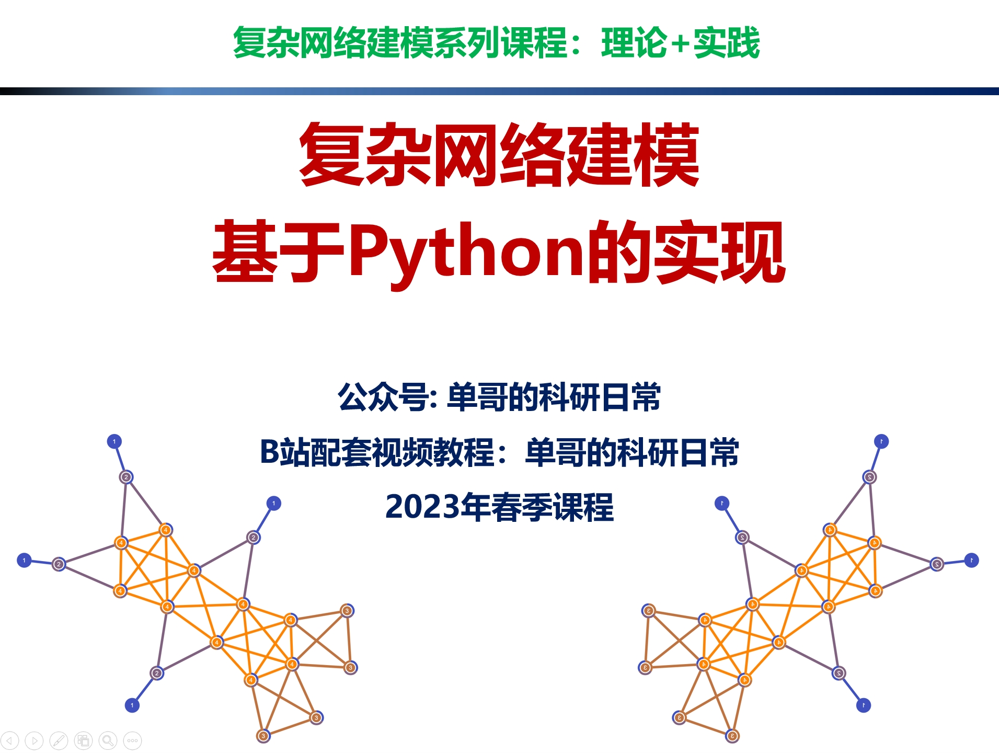
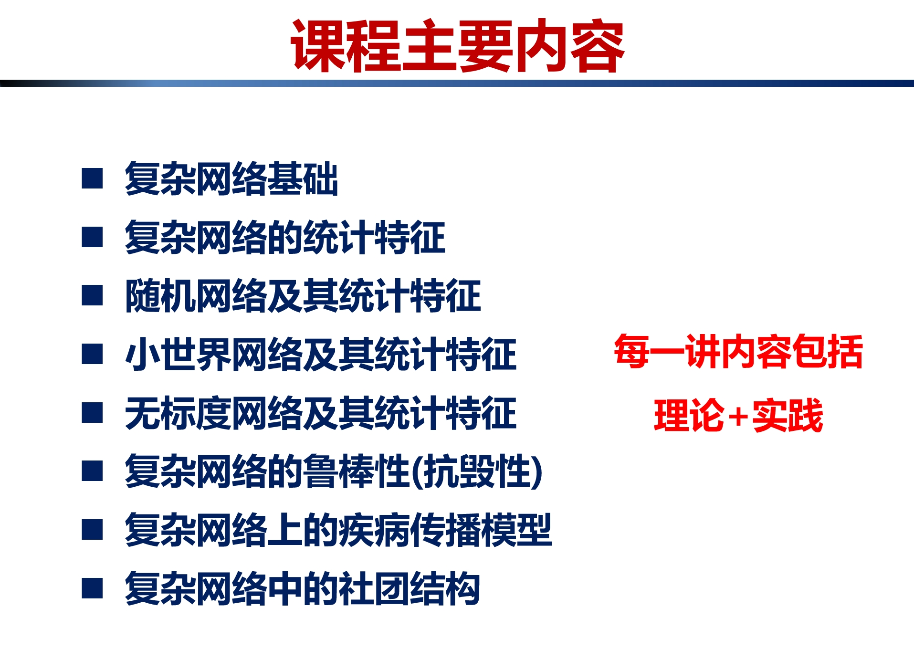
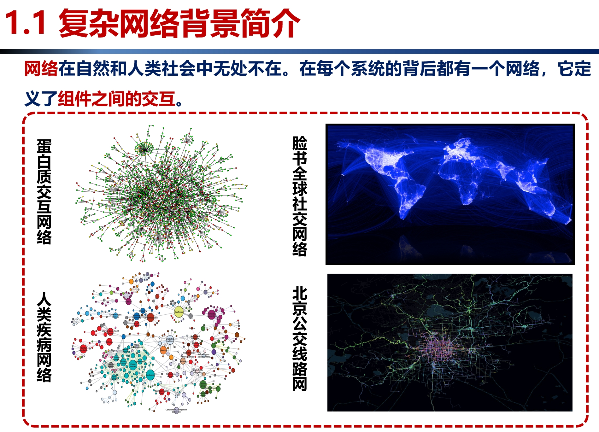
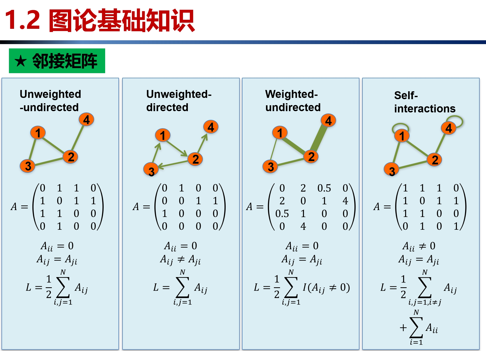
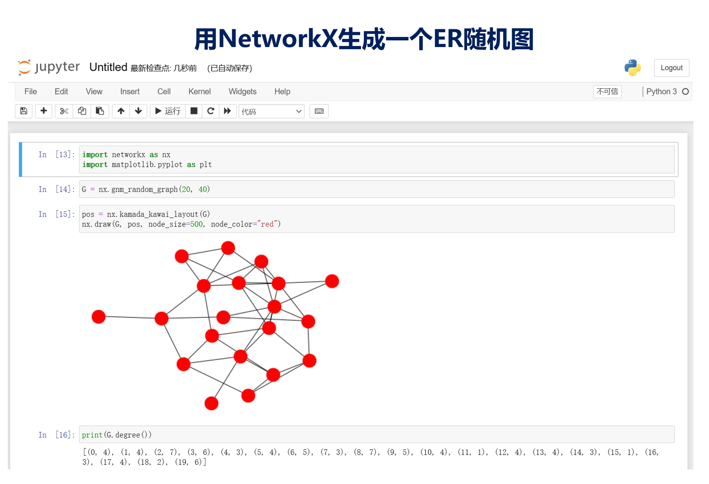

## 2022春季第一版课程：
[复杂网络建模：基于Python+NetworkX的实现](https://www.bilibili.com/video/BV1WR4y1G7kH/)（点击可跳转课程界面）。

另一门基础课程[NetworkX编程实践基础]([NetworkX编程实践基础：01熟悉networkx官方教程_哔哩哔哩_bilibili](https://www.bilibili.com/video/BV1Wa411N7NH/?vd_source=519dd7a4b1f4260ebe31140657f52698))，[配套代码](https://github.com/dange-academic/networkx_example_code)。

## 2023春季新版课程：
[复杂网络建模：基于Python的实现](https://www.bilibili.com/video/BV1GM4y1Q76f/?vd_source=519dd7a4b1f4260ebe31140657f52698)（点击可跳转课程界面），[配套代码](https://github.com/dange-academic/Modeling_complex_networks)。

